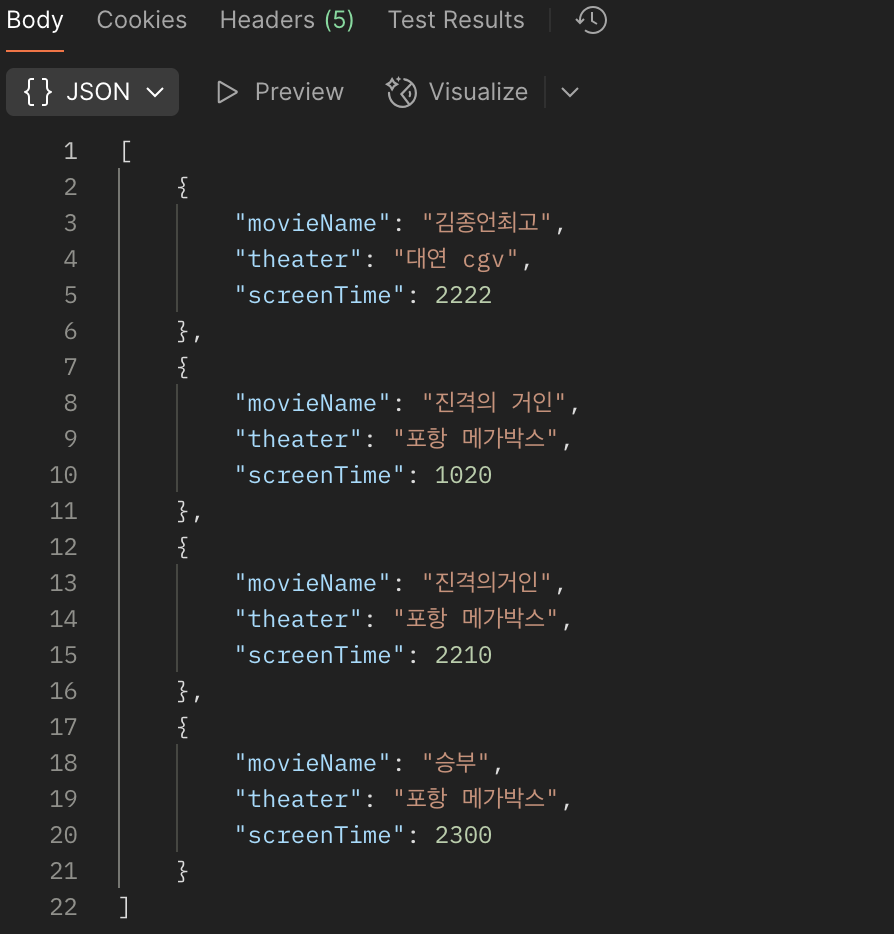
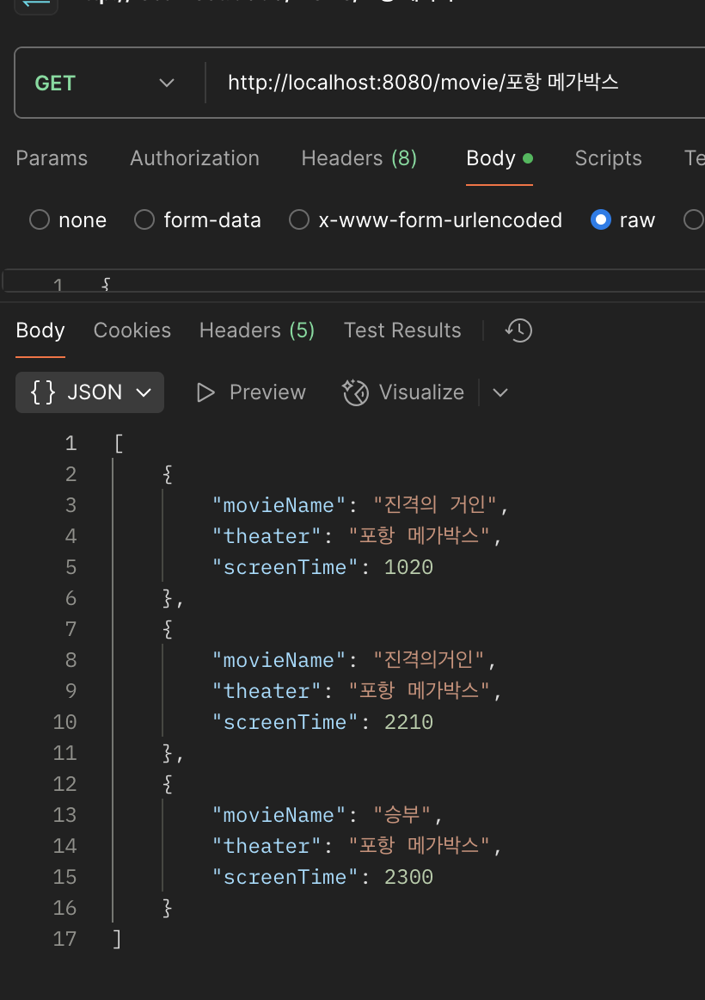
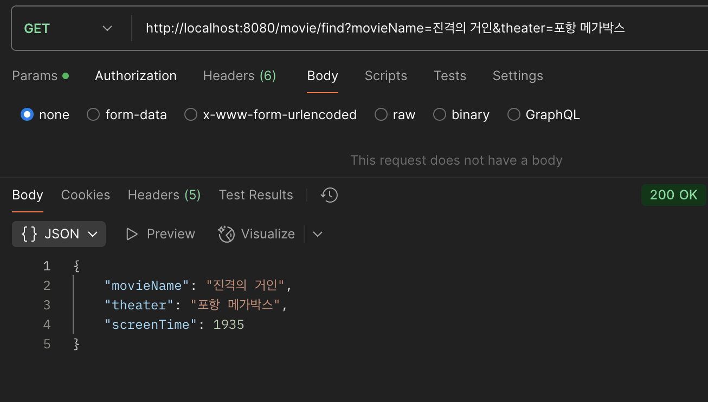
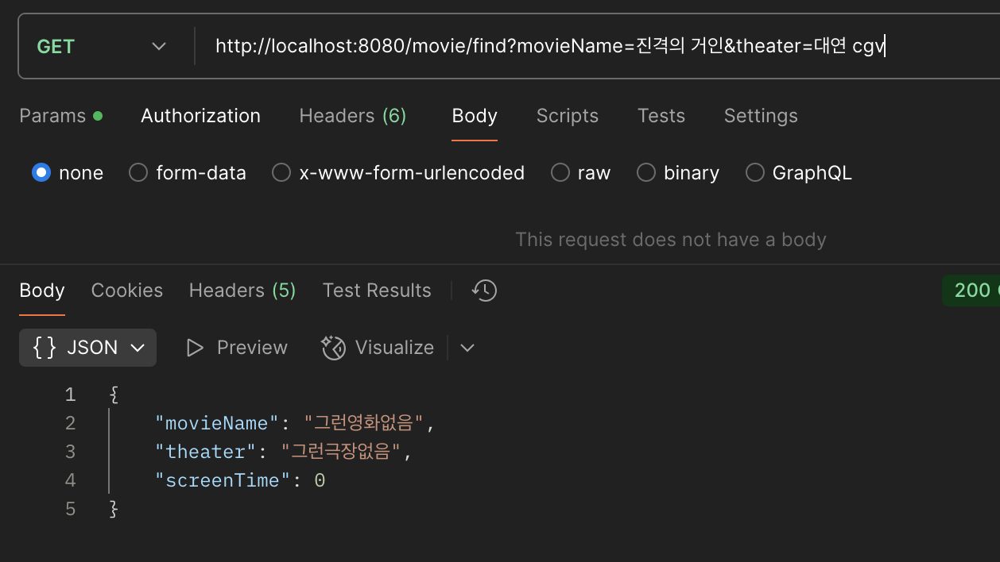
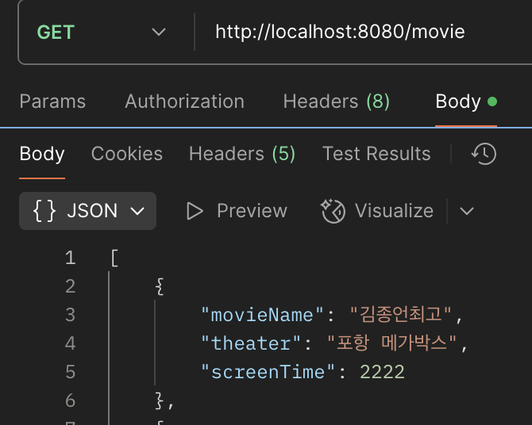
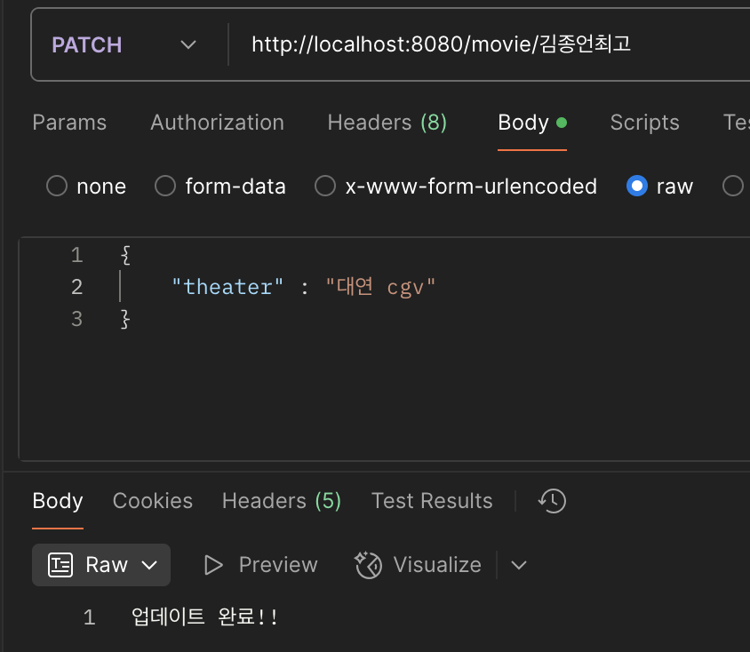
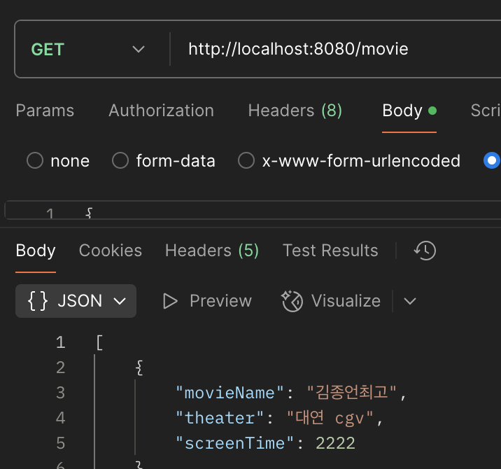

# HW2 - CRUD 컴온 마 브라더
---
시작에 앞서, 지난 주 김종언식 LifeStyle의 리드미를 보고 다들 아주그냥 뻑이 갔길래 하는 수 없이 세파에 휩쓸려주기로 마음 먹었다..

어떤 것을 주제로 CRUD를 만들어 보면 좋을까 수차례 고민하던 차..
요 몇 주동안 팀 인간들과 진격의 거인 보러간다고 맨날 일정 정했다가 바꿨다가 다음주에 영화가 올라오니 마니 하루죙일 메가박스 모니터링 중이었다.

다른 지역 상영시간표는 다 올라오는데 왜 포항만 자꾸 안올라오냐고 일 안하냐고 찡찡대다 이것을 만들기로 결심하였다.

그럼 가보자 나의 형제들아.

++ 사진크기 줄이지 못해 미안합니다. 지금 너무 귀찮아서요. 좀 멀리서 봐줘요.

https://velog.io/@chianddo223/Layered-Architecture

https://velog.io/@chianddo223/%EC%97%AC%EB%9F%AC%EA%B0%80%EC%A7%80-Annotations
정리한 내용을 모두 올리기에는 시간이 많이 걸릴 것 같아 급한대로.

#### 나의 C R U D 하나하나씩 뜯어보자꾸나.

---
# C
Create. 창조. 

주님 나의 그녀는 창조된 것이 맞습니까.

save 기능 한개뿐이다. 그것만으로 충분하니께.

#### Controller.
```
@PostMapping("")
public String save(@RequestBody UserDto userDto){
userService.save(userDto);
return "저장완료!!!";
}
```
@RequestBody로 body 요청해서 UserDto 받는다 끝.

#### Service.
```
public void save(UserDto userDto) {
        userRepository.save(userDto);
    }
```
바~로 그냥 받은거 userRepository에다가 던져버린다. 간사한 자식.

#### Repository.
```
    public void save(UserDto userDto){
        User user = User.builder()
                .movieName(userDto.getMovieName())
                .screenTime(userDto.getScreenTime())
                .theater(userDto.getTheater())
                .build();
        db.put(userDto.getMovieName(), user);
    }
```
builder 패턴으로 저장하고 put 조져버린다. Create 끝.

---
# R

Read. 오늘따라 오석에 자리가 텅텅 비었군 마치 나의 마음을 읽은듯.

나는 Read에 힘을 좀 썼다. 그래야할 것 같아서. 이것저것 꽤나 욕심내어 건드려봤다. 원하는 대로 됐던 것도 있고, 그렇지 못했던 것도 있었다. 

그것이 남자의 인생. 이제는 두렵지않다.


## 1. findAll
사실 너무 진부해서 안만드려고 했다가 얘가 개발단계에서 꼭 필요할 것만 같아서 제일 먼저 만들었다.

별거 없다. 그냥 세미나때 했던거랑 똑같다.


## 2. findMoviesByTheater
포항 메가박스를 조회해야 되는데 자꾸 부산 사상 메가박스로 시간을 봐서 잘못 알려줬던 나의 실수에 대한 참회의 의미로 만들어보았다. 

미안하다 은우야. 이거보면 100만원 줄게 응 너 이거 절대 못봐 ㅋㅋ

각설하고, 상영하는 영화관에 따라 영화를 찾는 녀석이다.

#### Controller.
```
@GetMapping("/{theater}")
    public List<UserDto> findMoviesByTheater(@PathVariable String theater){
        return userService.findMoviesByTheater(theater);
    }
```
@PathVariable로 상영관 값을 입력받는다. 나는 입력 상영관에 해당하는 모든 영화를 보여줄 것이기에 List<UserDto>로 Return한다.

Service는 별거 없으니 패스.
#### Repository.
```
    public List<UserDto> findMoviesByTheater(String theater) {
        return db.values().stream()
                .filter(user -> theater.equals(user.getTheater()))
                .map(user -> UserDto.builder()
                        .movieName(user.getMovieName())
                        .theater(user.getTheater())
                        .screenTime(user.getScreenTime())
                        .build()).toList();
    }
```
먼저 저번에 세미나때 배웠듯이 db에 있는 녀석들을 촤르르 흩어놓는다. 
그리고 filter을 통해 입력받은 theater과 일치하는 이름을 갖는 녀석들을 걸러낸다. 

그자식들을 또 map을 통해 UserDto에다가 복사해주고, toList로 합쳐준다. 그리곤 return.

### - 실행예시 -


이렇게 여러가지 영화들을 저장해둔 다음,



URL에다가 내가 원하는 상영관을 입력하니, 그에 해당하는 영화 목록들이 나오는 모습.
좋았다.


## 3.findMovieByNameAndTheater

나는 더 확실하게 내가 원하는 영화 제목과 상영관의 영화 정보를 보고싶었따.
#### Controller.
```
@GetMapping("/find")
    public UserDto findMovieByNameAndTheater(@RequestParam String movieName, @RequestParam String theater){
        return userService.findMovieByNameAndTheater(movieName, theater);
    }
```
두가지 입력값을 멋있게 담아내고자 @RequestParam을 조져보았다. 

#### Repository.
```
public UserDto findMovieByNameAndTheater(String movieName, String theater) {
        return   db.values().stream()
                .filter(user -> theater.equals(user.getTheater()) && movieName.equals(user.getMovieName()))
                .map(user -> UserDto.builder()
                        .movieName(user.getMovieName())
                        .theater(user.getTheater())
                        .screenTime(user.getScreenTime())
                        .build())
                .findFirst()
                .orElse(UserDto.builder()
                        .movieName("그런영화없음")
                        .theater("그런극장없음")
                        .screenTime(0)
                        .build());
    }
```
이녀석 아주 공들였다. 먼저 앞부분의 과정은 위에 findMoviesByTheater와 비슷하게 filter로 내가 원하는 입력값과 일치한 녀석을 찾아낸다.


그중 첫번째 놈을 가려낸다. 근데 어차피 우리는 movieName을 키로서 저장하고 있기 때문에 한놈밖에 안남는다. 그놈을 내 눈 앞으로 데려오란 말이다.

내가 찾는 영화가 없을 때 기본값 또한 반환해주고 싶었다. orElse를 통해 임의로 조작해 낸 UserDto를 builder 패턴으로 찍어내 리턴해준다.


### - 실행예시



이것을 보라 
#### 진격의 거인
#### 포항 메가박스
#### 19:35

내가 곧 볼 영화다. 하 또 생각하니 가슴이 뜨거워지는구나. 신조 사사게오~



찾는 영화가 없으면 이렇게 기본값을 반환해준다. 아주 얄짤없어버리지 그냥.

이로써 Read 끝. 아주 공들였던 나의 브라더 수고가 참 많았다.

---
# U
Update.

내 뒤에계신 17학번 토레이 왕고 성엽이 형님께 얼마동안 계셨냐고 물어보니 오석에 2시부터 계셨다고, 
3시간 정도밖에 안 있었다고 하신다. 

지금은 7시인데. 업데이트가 안되신 모양이다. 그러실만도 하지. 성엽이형 항상 사랑합니다.

#### Controller.
```
@PatchMapping("/{movieName}")
    public String updateTheaterByMovieName(@PathVariable String movieName, @RequestBody TheaterDto theaterDto){
        userService.updateTheaterByMovieName(movieName, theaterDto);
        return "업데이트 완료!!";
    }
```

#### Repository.
```
public void updateTheaterByMovieName(String movieName, TheaterDto theaterDto){
        User user = db.get(movieName);
        user.updateTheater(theaterDto.getTheater());
    }
```

기가맥힌 Update를 하기위해 여러 방법을 시도했으나 결국 실패했다. 괜찮다. 결국 전체적인 흐름은 세미나때 코드와 거의 동일하다.

#### 하지만 but~

```
public class TheaterDto {
    private String theater;
}

```

상영관만 입력하는 DTO를 받고싶어 TheaterDto를 따로 만들어 받는다. 그리고 입력된 movieName에 해당하는 user에다가 그 녀석을 update해버린다.
```
public class User {
    private String movieName;
    private String theater;
    private int screenTime;

    public void updateTheater(String theater){
        this.theater = theater;
    }
}
```
또한 Entity에서는 @Setter 사용을 지양해야 한다는 것을 알게 되어 업데이트 메소드를 따로 만들어 드렸다.

결과적으로 입력받은 TheaterDto에 상영관을 updateTheater 메소드에 넣어 user을 업데이트 해버린다.

### -실행예시_



이녀석을



이렇게 영화 "김종언최고"와 함께 필요한 theater만 입력해주면,



요롷게 업데이트가 되는 모습!! 김종언 최고!!

---
# D
Delete. 제거는 소리없이 깔끔하게.
#### Controller.
```
 @DeleteMapping("/{movieName}")
    public String delete(@PathVariable String movieName){
        userService.delete(movieName);
        return "삭제완료~~";
    }
```

#### Repository.
```
public void delete(String movieName) {
        db.remove(movieName);
    }
```

세미나때랑 별차이 없다. 아 배고프고 피곤하고 미쳐버리것다. 이쯤하자 CRUD 자식아 만나서 반가웠다.


