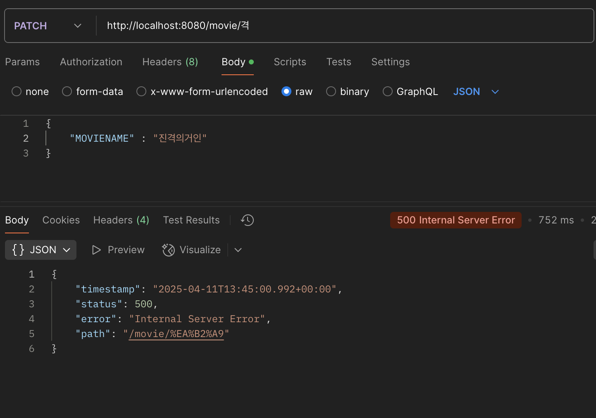
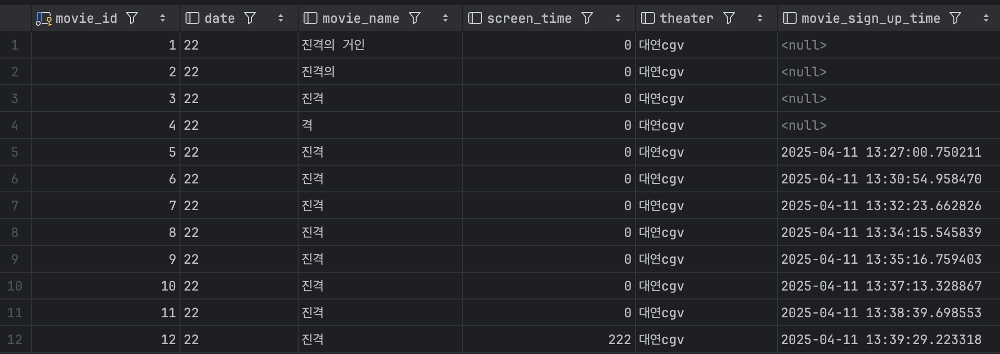
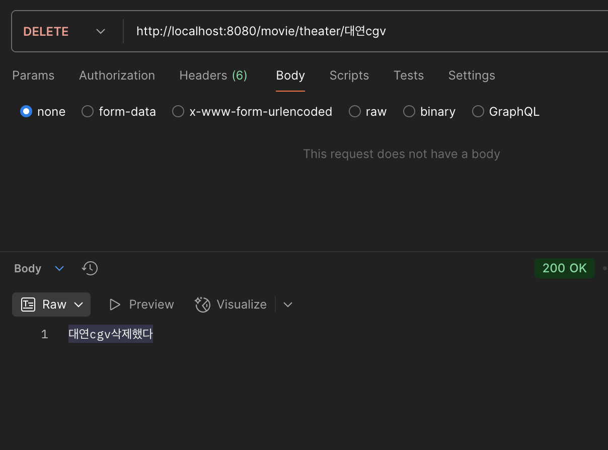
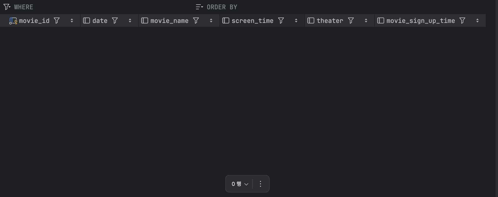

# HW3 인생은 예측할수 없다.
---

생각보다 시간도 많이 걸리고 안되는게 많네요.
하지만 그것이 공부니까 그것이 인생이니까

용서해주십쇼.
#### 지난주랑 별다를거 없음
하지만~ 멋진 기능을 구현시키기 위해 노력했다는 것!
```
public enum MovieField {
    MOVIENAME{
        @Override
        public void update(Movie movie, String value){
            movie.updateMovieName(value);
        }
    },

    THEATER{
        @Override
        public void update(Movie movie, String value){
            movie.updateTheater(value);
        }
    },

    SCREENTIME{
        @Override
        public void update(Movie movie, String value){
            movie.updateScreeTime(parseInt(value));
        }
    },

    DATE{
        @Override
        public void update(Movie movie, String value){
            movie.updateDate(value);
        }
    };

    public abstract void update(Movie movie, String value);
}

```
이것은 열거형 enum이라는 것인데, 여기서는 MovieField의 객체 값을 자동으로 매핑해줘서 그에 따른 로직을 수행하게끔 해준다.

이걸 시도한 이유는 update를 할 때 하나의 필드만 Dto로 받고, 그 Dto의 값이 무엇이냐에 따라 원하는 필드를 수정하는 맛깔난 update기능을 구현하기 위해서!!

```
public class UpdateFieldDto {
private MovieField movieField;
private String value;
}
```
이것은 enum MovieField를 사용하기 위해서 필드이름과 그 값을 직접 받는 UpdateFieldDto시다!!

여기서 MOVIENAME, SCREENTIME 등 movieField의 값을 매핑해 그에 따른 메소드를 실행!! 그리곤 value를 넣어서 update 시켜주는 거시다



근데 어쩐 이유에서인지 안댐 ㅋㅋ

이거만드는데 시간이 너무 많이 들어서 결국 고치지 못하고 넘어갔다.. 좀있다가 꼭 고쳐야지.

---

### 나만의 JPA문법

```
public interface MovieRepository extends JpaRepository<Movie, Long> {
    Movie findByMovieName(String movieName);

    List<Movie> findMoviesByScreenTimeGreaterThan(int screenTime);

    List<MovieDto>findByTheater(String theater);

    void deleteByTheater(String theater);
}
```
이것이 저의 굉장히 별거없는 JPA 문법들입니다. 

어떤 친구들이 있는지 공부는 열심히 하였다만. 간단한 친구들로 한번 만들어 보았습니다.

다음주에는 더더욱 강력하고 멋있는 기능들을 구현해보도록 하겠습니다.


자자 이렇게 많던 친구들에다가



요롷게 조져주니까



짠 모든 테이블이 싹 사라진 모습!(역재생 아닙니다)

공부한 내용을 리드미에 직접 쓰고싶지만 항상 시간이 부족하네요.

정리해둔 자료를 투척하고 이만 사라져보겠습니다람쥐

https://velog.io/@chianddo223/JDBC-JPA