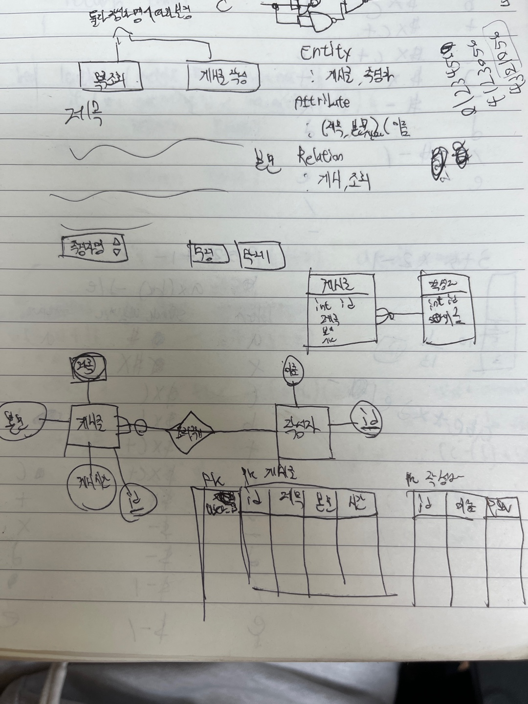
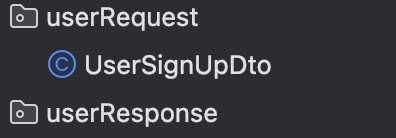
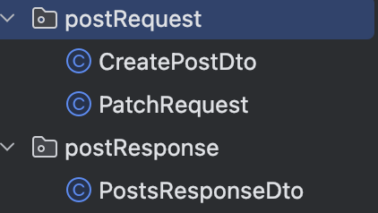
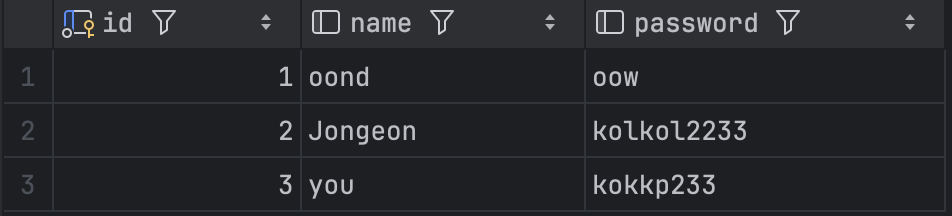
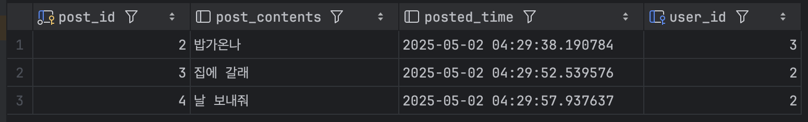
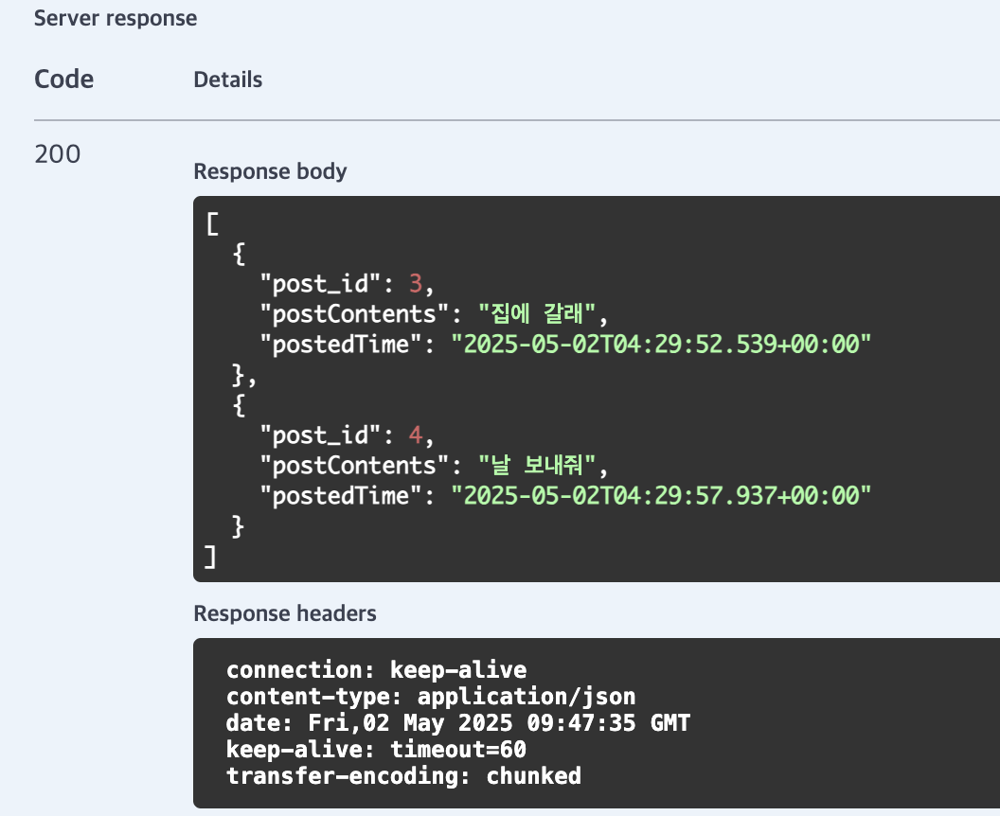
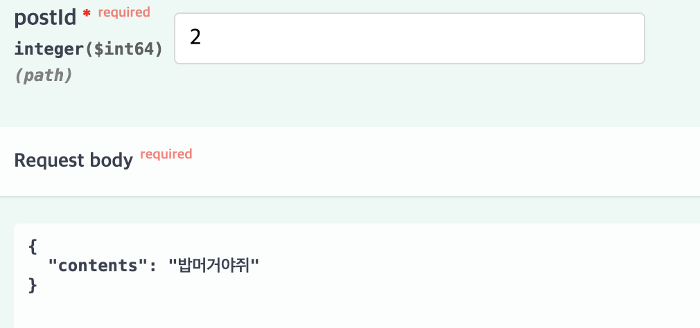
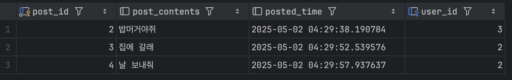

연휴라고 다들 집에 간다고 삼삼오오 모여 택시를 기다리고 있더군요.

집한번 가보겠다고 애쓴다 ㅋ 라는 표정으로 그 사이를 슥슥 지나오는 길입니다. 마음속으론 너무 부러웠지만요.

오늘 날씨가 정말 기가 막히더라구요. 거의 뭐 날씨의 아이 히나 죽은줄 알았습니다. 

이렇게나 집에 가고싶고 좋은 날씨, 여유를 즐기고 싶은 마음 고이 접어두고 그 시간 바친 것..
# HW4. 시작하겠습니다.
먼저 이번 블로그 플랫폼은 컨셉이고 자시고 그냥 기능에만 집중했습니다.

먼저 Entity들의 연관관계와 테이블의 관계를 정리하고, 시작해보았습니다.

이렇게 아날로그한 방식으로 먼저 Post와 User의 관계를 정리했습니다. 한번 정리해두고 나니 구현하기에 수월하더군요. 나중에 기획자와 서비스에 대해 소통할 때에도 도움이 되겠습니다.

게시글은 작성자에게 여러개 있을 수 있는 ManyToOne 관계이고, user_id로서 fk를 취한 모습니다.

```
public class User {
    @Id
    @GeneratedValue(strategy = GenerationType.IDENTITY)
    private Long id;

    private String name;
    private String password;

    @OneToMany(mappedBy = "user", cascade = CascadeType.ALL, orphanRemoval = true)
    private List<Post> posts;
}
```
이것이 나의 User이요~

```
public class Post {
    @Id
    @GeneratedValue(strategy = GenerationType.IDENTITY)
    private Long post_id;
    private String postContents;

    @CreationTimestamp
    private Timestamp postedTime;

    @ManyToOne
    @JoinColumn(name = "user_id")
    private User user;

    public void updateContents(String postContent){
        this.postContents = postContent;
    }


}
```
이것이 나의 Post 일세~

user의 id를 fk로 설정해두었습니다.

post되는 시간을 띄우고자 Timestamp도 넣어봤습니다. 

---
## 고생이 많은 Dto들

User같은 경우에는 SignUp기능만 구현했기 때문에 RequestDto만 만들었네요.


Post는 post기능과 수정하는 Patch RequestDto를 구성했습니다.

또 작성자별 Post들을 확인하는 ResponseDto를 구현했습니다.

---
```
    @PostMapping("")
        public void createPost (@RequestBody CreatePostDto createPostDto){
        postService.createPost(createPostDto);
    }

    @GetMapping("")
    public List<PostsResponseDto> readPosts(@RequestParam Long userId){
        return postService.readPosts(userId);
    }
```
User부분은 별거없으니까 중요한 Post부분 보시겠습니다. 
CreatePost같은 경우에는 뭐 당연히 Body를 직접 받아와줍니다. 만들어놓은 CreatePostDto에 담아서 말이죠. 

readPosts에서는 오직 userId만 RequestParam으로 받아줍니다. 우리가 필요한 것은 userId만 있으면 되기 때문이죠.

그리고 Get요청에서는 Body를 직접 넘겨줄 수 없다는 사실을 알았습니다. 그래서 특정 고유값을 받아올 때는 PathVariable, 필터링이나 정렬등이 필요할때는 RequestParam을 사용하는게 좋다네여.

```
public class CreatePostDto {
private String contents;
private Long user_id;
}
```
CreatePostDto같은 경우에는 Post의 내용과 user_id를 보내주면 됩니다.

user_id를 통해 User을 찾고, 그녀석을 Post에 담는 순서가 될겁니다.
```
public class PostsResponseDto {
    private Long post_id;
    private String postContents;
    private Timestamp postedTime;
}
```
PostsResponseDto는 입력받은 user_id에 해당되는 게시글의 정보만 보여주면 됩니다.

---
다음으로 가장 중요한 postService를 보여드리겠습니다.


```
public void createPost(CreatePostDto createPostDto){
        User u = userRepo.findById(createPostDto.getUser_id()).orElseThrow();
        Post p = Post.builder()
                .postContents(createPostDto.getContents())
                .user(u)
        .build();

        postRepo.save(p);
    }

```
받은 user_id의 User를 userRepo에서 찾고, createPostDto에 담겨있는 정보를 build를 통해 Post에 입력해주고 저장합니다.


```
    public List<PostsResponseDto> readPosts(Long userId){
        User user = userRepo.findById(userId).orElseThrow();
        List<Post> posts = postRepo.findAllByUser(user);
        List<PostsResponseDto> postDtos = posts.stream()
                .map(post -> PostsResponseDto.builder()
                        .post_id(post.getPost_id())
                        .postContents(post.getPostContents())
                        .postedTime(post.getPostedTime())
                        .build()).toList();

        return postDtos;
    }
```
위랑 똑같이 user_id를 통해 해당 User을 찾아냅니다. 그리고 postRepo에서 해당하는 유저의 모든 post들을 받아옵니다.

이때 이미 필터링이 되어있습니다. (필터링은 db에서 미리 해오는게 효율적이라고 합니다.)

이후로는 순서대로 쭉쭉 넣어주고, 리턴해주면 됩니다.

---
## 실행.

signup? 잘 ~ 됩니다.


createPost? 잘 ~ 됩니다.


readPosts? 잘 ~~ 됩니다.[Downloads](../../../Downloads)



Patch? 잘~~ 됩니다~~~

내인생 ?? 잘~~~ 될까용~?~?

여러분이 답해줘요!! 안녕~